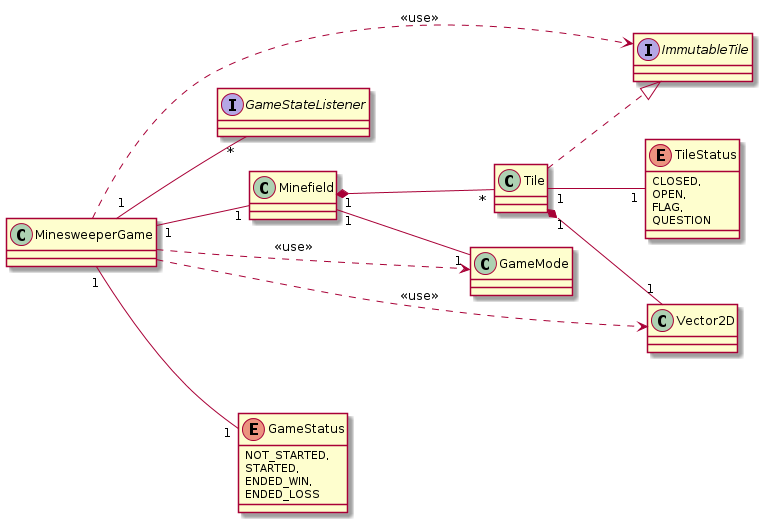
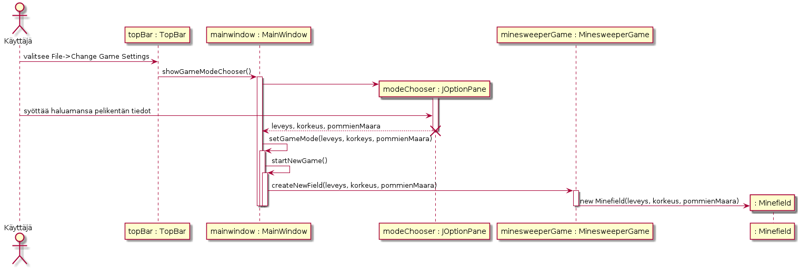
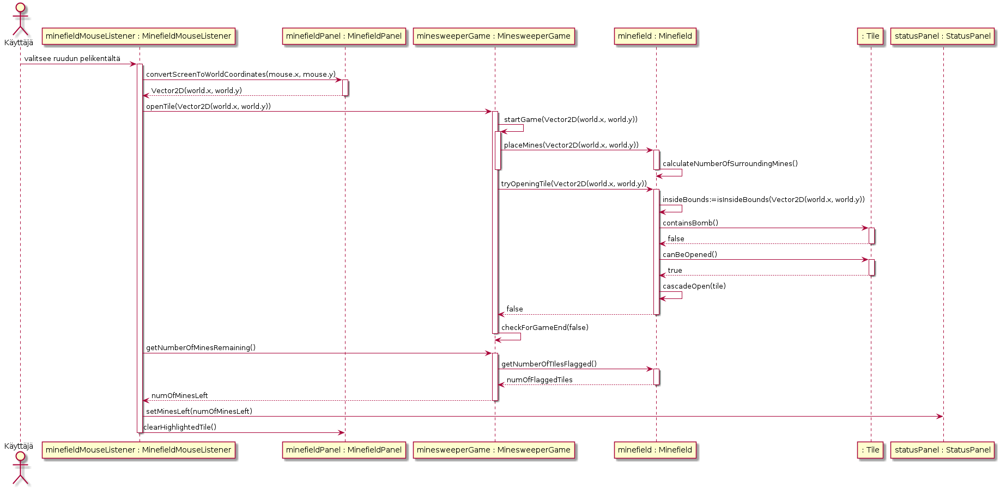

**Aihe:** perinteinen miinaharavapeli. Pelikenttä koostuu ruudukosta ja ideana on avata kaikki ruudut, jotka eivät sisällä miinaa. Jokainen avattu tyhjä ruutu kertoo, montako miinaa sen ruudun ympärillä on. Jos avatun ruudun vieressä toinen ruutu, jonka ympärillä ei ole yhtään miinaa avataan tämä ruutu automaattisesti. Peli loppuu, kun pelaaja avaa ruudun, joka sisältää miinan, tai kaikki tyhjät ruudut on avattu.

**Tiivistetty kuvaus pelin kulusta:**

1. Käyttäjä avaa sovelluksen
  * Peli avautuu esimerkiksi valmiiksi 9x9 ruudukkoon
2. Käyttäjä valitsee halutessaan eri kokoisen ruudukon ja/tai miinamäärän
3. Pelaaja valitsee ruudun
  *Ensimmäinen valittu ruutu ei voi olla miina
4. Jos ruutu ei ollut miina ja on vielä avaamattomia tyhjiä ruutuja, palaa takaisin 3. vaiheeseen
  * Jos ruutu oli miina, peli loppuu ja kaikki ruudut avataan. Käyttäjä voi aloittaa uuden pelin valitsemalla "Restart"
5. Näytä "voittoruutu", joka sisältää tiedon käytetystä ajasta ja sisältää tekstikentän pelaajan nimimerkkiä varten
6. Käyttäjä syöttää nimimerkin ja painaa "Submit"

**Käyttäjän toiminnot:**

Pelaaja voi:
- valita peliruudukon koon ja miinojen määrän ✓
- avata ruudun ✓
- merkitä ruudun lipulla, jolloin sitä ei voi avata ennen kuin lippu poistetaan ✓
- aloittaa uuden pelin missä tahansa vaiheessa ✓
- katsoa tähän asti kulutetun ajan ✓
- tallentaa voitettuun peliin käytetyn ajan nimimerkin kanssa ✓
- katsoa parhaat ajat ✓

**Rakenteen kuvaus:**

Suurin osa pelin logiikasta sijaitsee Minefield-luokassa, joka on vastuussa ruutujen (Tile) tilan muuttamisesta, eli ruutujen avaamisesta, liputuksesta. Tile-luokka kuvaa yksittäistä pelin ruutua ja sisältää tiedon ruudun tilasta, jota kuvaa TileStatus, ja mahdollisesta pommista. Minefield-luokka antaa ulkopuolelle pääsyn ruutuihin ImmutableTile-rajapinnan kautta, jonka kautta ruudun tilan voi vain lukea. Vector2D on yleiskäyttöinen luokka, jota käytetään esim. ruudun sijainnin tallentamiseen.

MinesweeperGame-luokan tarkoituksena on säilyttää Minefield-luokan ilmentymää sekä pitää kirjaa pelin tilanteesta (GameStatus) ja kulutetusta ajasta. GameStateListener tarjoaa rajapinnan pelin tilan vaihtumisen kuunteluun.

**Projektin luokkakaavio**

**Sekvenssikaavio pelikentän muuttamisesta**

**Sekvenssikaavio ensimmäisen ruudun avaamisesta**

